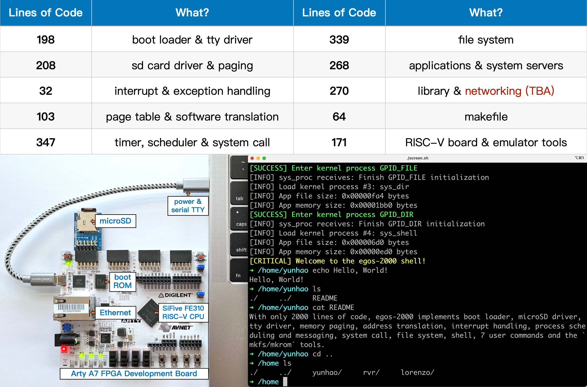

## Vision

With only **2000** lines of code, egos-2000 implements every component of an operating system for education. 
It can run on a RISC-V board and also the QEMU software emulator.



```shell
# The cloc utility is used to count the lines of code (LOC).
# The command below counts the LOC of everything excluding text documents.
> cloc egos-2000 --exclude-ext=md,txt
...
github.com/AlDanial/cloc v 1.94  T=0.05 s (949.3 files/s, 62349.4 lines/s)
-------------------------------------------------------------------------------
Language                     files          blank        comment           code
-------------------------------------------------------------------------------
C                               37            510            665           1579
C/C++ Header                    10             68            105            285
Assembly                         4              6             31             72
make                             1             12              0             64
-------------------------------------------------------------------------------
SUM:                            52            596            801           2000 (exactly 2000!)
-------------------------------------------------------------------------------
```

## Earth and Grass Operating System

egos-2000 was developed as a new teaching OS for CS5411/4411 at Cornell. It adopts a 3-layer architecture.

* The **earth layer** implements hardware-specific abstractions.
    * tty and disk device interfaces
    * interrupt and memory management interfaces
* The **grass layer** implements hardware-independent abstractions.
    * processes, system calls and inter-process communications
* The **application layer** implements file system, shell and user commands.

The definitions of `struct earth` and `struct grass` in [this header file](library/egos.h) specify the layer interfaces.

### Usages and Documentation

For compiling and running egos-2000, please read [this document](COMPILING.md).
The [RISC-V instruction set manual](references/riscv-privileged-v1.10.pdf) and [SiFive FE310 manual](references/sifive-fe310-v19p04.pdf) introduce the privileged ISA and processor memory map.
[This document](references/README.md) further introduces the teaching plans, architecture and development history.


## Acknowledgements

Many thanks to [Robbert van Renesse](https://www.cs.cornell.edu/home/rvr/), [Lorenzo Alvisi](https://www.cs.cornell.edu/lorenzo/), [Shan Lu](https://people.cs.uchicago.edu/~shanlu/) and [Hakim Weatherspoon](https://www.cs.cornell.edu/~hweather/) for supporting this project.
Many thanks to Meta for a [Meta fellowship](https://research.facebook.com/fellows/zhang-yunhao/).
Many thanks to all CS5411/4411 students at Cornell over the years for helping improve this course.

--------------------------------------------------------------------------------------------------------------------------------------------------------------------------------------------

# Implementation: Scheduling

For this assignment you will be making modifications to the egos-2000 operating system.  You will be implementing a new scheduler, a new system call, and a few assorted utility programs.

You may complete this assignment in groups of up to two people. If you wish to be in a group you must add your group to the spreadsheet linked in the Canvas assignment no later than 07/02/23 at at 11:59pm. 

## Requirements

### Scheduler
Change the scheduling in scheduler.c from a round robin to a lottery scheduler.  Priorities are represented as integers from 1 to 10 with 1 being the highest priority.  Each priority level must have its own queue.

You can think of your scheduler as having one run queue and 9 levels of waiting queues.

You must keep both schedulers, the round robin and your new scheduler.  You will use a #define and #ifdef / #endif to choose the scheduler you want to compile into your OS.

### Default priority
All processes must start with a default priority of 2, except for the four kernel processes. The kernel processes start with a priority of 1.

### Implement setprio system call
Implement the setprio system call to allow processes to set their priority. The priority must be between 1 and 10.  

### Process control blocks
To the process control block add:
1. Priority, an integer from 1 to 10
2. Current aged priority
3. Number of context switches, an integer representing the nunmber of times a process is scheduled to be run by the scheduler

### kill

Add a user application kill.c that takes a PID as a command line parameter and kills the process that has the user supplied PID.

You will need edit tools/mkfs.c to add your new executable to disk image.  You will need to add a new type of proc_req: PROC_KILL and the associated code in servers.c and sys_proc.c

### ps 
Add functionality to the ps command in ps.c to display:
1. Process priority
2. Number of context switches

```shell
➜ /home/cse3320 ps
PID     STATUS  PRIORITY  CTX
1       11      1         50    
2       5       2         23
3       4       1         49
4       4       3         12
6       4       2         19
......
```
### test_pri
Add a user program test_pri.c in apps/user.  This program will take two command-line parameters: number of iterations to run and priority.
```shell
➜ /home/cse3320 test_pri 100 2
......
```
The above example will run 100 times at priority level 2 and print its PID.
You will need edit tools/mkfs.c to add your new executable to disk image.

## How to submit code and report.

Your program source code is to be turned in via the Feedback GitHub pull request. Do not merge this pull request. Submission time is determined by the GitHub system time. You may push your code as often as you wish. Only your last submission will be graded.

## Administrative

This assignment must be coded in C. Any other language will result in 0 points. Your programs will be compiled and graded on the course GitHub Codespace. Code that does not compile with the provided makefile will result in a 0.


